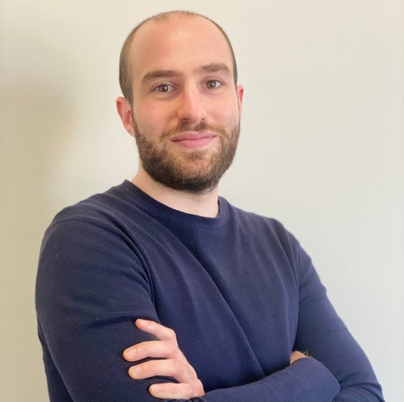
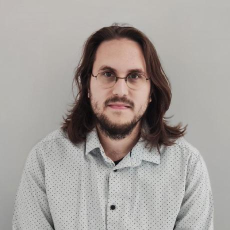
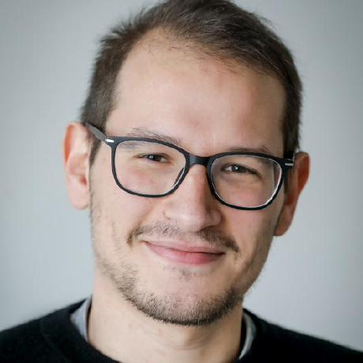

## Organizing Committee ##

<table>
    <col width="20%" />
    <col width="20%" />
    <col width="20%" />
    <col width="20%" />
    <col width="20%" />
    <tr>
        <td></td>
        <td></td>
        <td></td>
        <td></td>
        <td></td>
    </tr>
    <tr>
        <td> 
            <a href='https://www.tudelft.nl/en/eemcs/the-faculty/departments/intelligent-systems/cybersecurityeemcs/people/andrea-agiollo'>Andrea Agiollo</a>
            <a href='mailto:A.Agiollo-1@tudelft.nl'>📧</a>
        </td>
        <td> 
            <a href='https://bardhienkeleda.github.io'>Enkeleda Bardhi</a>
            <a href='mailto:E.Bardhi-1@tudelft.nl'>📧</a>
        </td>
        <td> 
            <a href='https://www.unibo.it/sitoweb/giovanni.ciatto'>Giovanni Ciatto</a> 
            <a href='mailto:giovanni.ciatto@unibo.it'>📧</a>
            <b>(Primary contact)</b>
        </td>
        <td> 
            <a href='https://sebdumancic.github.io/'>Sebastijan Dumancic</a>
            <a href='mailto:S.Dumancic@tudelft.nl'>📧</a>
        </td>
        <td> 
            <a href='https://www.giuseppemarra.com/'>Giuseppe Marra</a>
            <a href='mailto:giuseppe.marra@kuleuven.be'>📧</a>
        </td>
    </tr>
    <tr>
        <td> TU Delft, The Netherlands </td>
        <td> TU Delft, The Netherlands </td>
        <td> University of Bologna, Italy </td>
        <td> TU Delft, The Netherlands </td>
        <td> KU Leuven, Belgium </td>
    </tr>
 </table>

## Keynote

TBD.

## Program Committee

- Stefano Colamonaco, KU Leuven
- Pieter Simoens, University of Ghent
- Emanuele De Angelis, CNR Italy
- Rémy Chaput, CPE Lyon
- Reyhan Aydoğan, Ozyegin University 
- Roberta Calegari, University of Bologna
- Samy Badreddine, SONY
- Sofoklis Kyriakopoulos, City St George's University of London
- Stefano Mariani, University of Modena and Reggio Emilia
- Till Mossakowski, University of Osnabrück
- Tilman Hinnerichs, TU Delft
- Vaishak Belle, University of Edinburgh
- Vicent Costa, IIIA - CSIC Spain
- Vincent Dekinderen, KU Leuven
- Abhilekha Dalal, Kansas State University
- Andreas Wichert, INESC-ID University of Lisbon
- Angelo Ferrando, University of Modena and Reggio Emilia
- Arthur Ledaguenel, IRTSystemX and CentraleSupélec
- Damiano Azzolini, University of Ferrara
- Daria Stepanova, Bosch Center for Artificial Intelligence
- David Debot, KU Leuven
- Elena Umili, Sapienza University of Rome
- Emre Kuru, Ozyegin University
- Fabrizio Riguzzi, University of Ferrara
- Federico Sabbatini, University of Urbino
- Francesco Giannini, Scuola Normale Superiore Pisa
- Frank Van Der Velde, University of Twente
- Gheorghe Cosmin Silaghi, Babes-Bolyai University
- Giacomo Camposampiero, IBM Research
- Giacomo Frisoni, University of Bologna
- Gianluca Apriceno, Fondazione Bruno Kessler
- Gianluca Cima, Sapienza University of Rome
- Giuseppe Pisano, University of Bologna
- Hendrik Blockeel, KU Leuven
- Issa Hanou, TU Delft
- Jedrzej Potoniec, Poznan University of Technology
- Jiamou Liu, University of Auckland
- Katrin Schreiberhuber, Vienna University of Economics and Business
- Kislay Raj, Dublin City University
- Luca Salvatore Lorello, University of Pisa
- Lucile Dierckx, Universite Catholique de Louvain
- Maarten Stol, BrainCreators Amsterdam
- Majlinda Llugiqi, WU Wien
- Marco Console, Sapienza University of Rome
- Matteo Magnini, University of Bologna
- Mauro Dragoni, Fondazione Bruno Kessler
- Md Kamruzzaman Sarker, Bowie State University
- Michele Collevati, TU Wien
- Neil Yorke-Smith, TU Delft
- Nicholas Rossetti, University of Brescia
- Nitisha Jain, King's College London
- Octavio Arriaga, University of Bremen